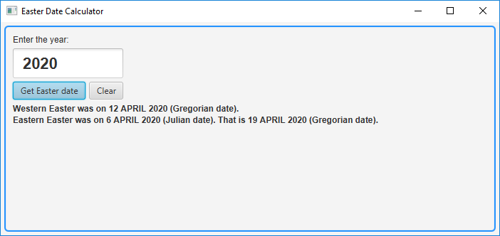
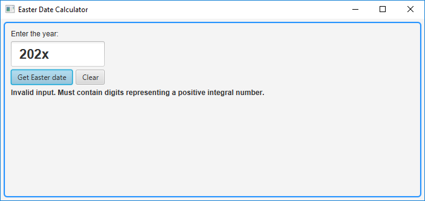
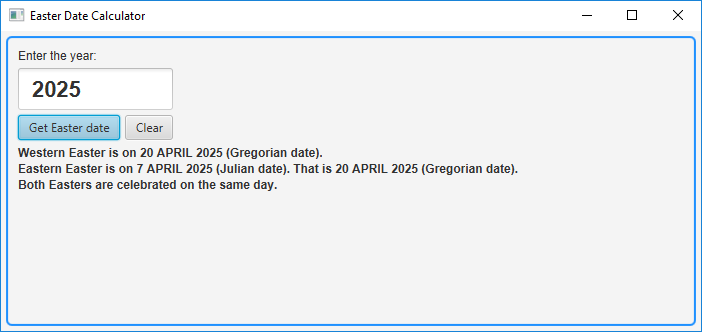
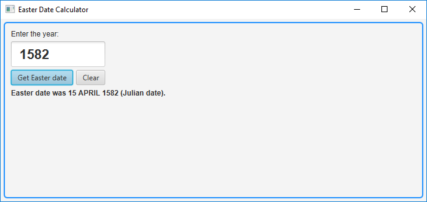
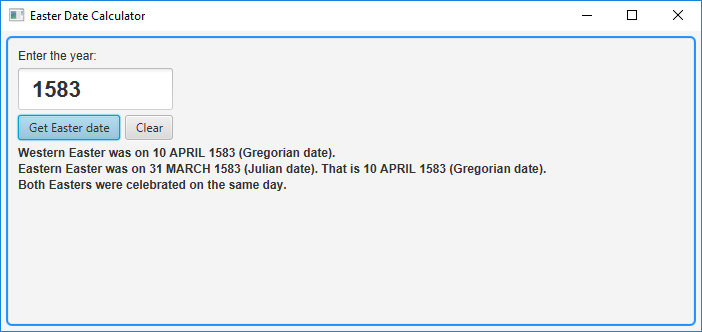
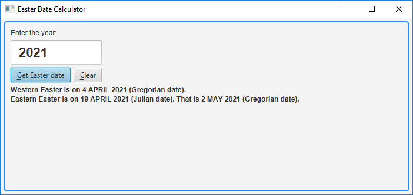
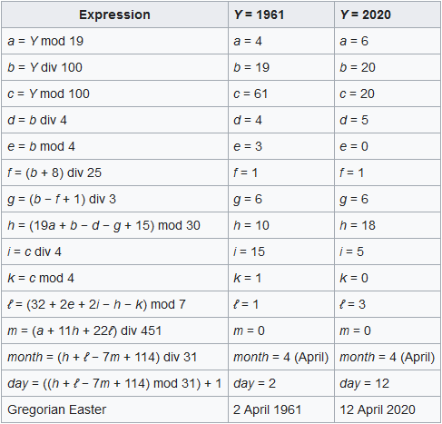
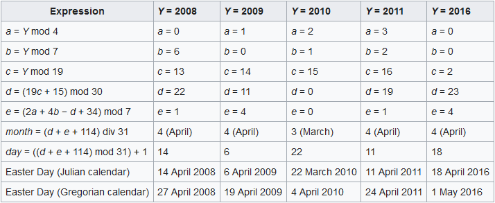
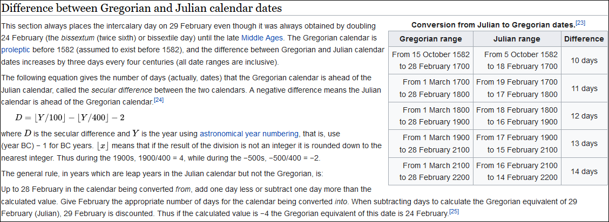

<h1>Easter Date Calculator Using JavaFX</h1>
<h3>Introduction</h3>
This application calculates Easter date for a year given by the user. It is written using Java FX, requires at least Java 8 and runs locally.
  
For years starting with 1583, the application returns both Western (such as Catholic and Protestant) and Eastern (Orthodox) Easter dates.
  
For years less than or equal to 1582, when Gregorian calendar was not being used, the application returns only one Easter date, using Julian Easter calculation and Julian Calendar.
  
In October 1582 the Gregorian calendar was introduced, and Western churches and societies adopted it over the years (some countries started adopting it early, others needed three centuries to embrace it). However, Eastern churches kept on using an algorithm based on Julian calendar when calculating Easter date, hence the difference in Easter days between West and East.
  
The calendar being used nowadays is the Gregorian Calendar. It is being used by both Western and Eastern societies. However, Orthodox Church is more conservative, so, when it comes to calculating Easter date, Orthodox Church uses an older formula, based on the Julian Calendar, despite the fact that Orthodox countries use the (modern) Gregorian Calendar.
  
So, when it comes to Eastern (Orthodox) Easter, this application returns both the Julian date (used by the Church) and its corresponding Gregorian date (used by the society).
<h3>The reason for creating this application</h3>
Every time Spring was approaching, I used to wonder when Easter was that year. I was not curious because of spiritual reasons, but rather earthly reasons (vacation planning). I'm not the kind who buys printed calendars and hangs them on walls, so I had to search on the internet every time. Living in an Orthodox country, I used to look for that information on local web sites (other web pages would have offered me Catholic Easter date) and I used to get a lot of articles from past years, which made my search susceptible to errors.
  
One day, I found an article about Easter date calculation and realized that I could write a software program that would offer me independence when needing to know Easter date. I did not immediately start the implementation, as I had other priorities. However, I have recently made myself some time and created this application.
<h3>Usage examples</h3>
The user has one text input field for the year and two buttons: one for submitting the form and obtaining Easter date(s) and one button that can be used to clear everything.
  
After entering a valid year, the user can obtain Easter Date:
  

 
Input is limited to a number of 8 characters. If the user exceeds the limit, the input is automatically shortened to respect the length limit.
  
After the user submits the form, the application validates the input, using a Java regular expression.
 
If the input string does not contain only digit characters (0-9), an error message is displayed:
  

 
The application also mentions if both Easters are celebrated on the same day:
  

 
The current date is read from the system on which the application runs, and if Easter date is on the current date, the application will mention it. It will not say any greeting, because the person running the application may not be Christian or may be of a different confession than the one for which Easter is celebrated that day. The application will only append "Today" remark when displaying Easter date.
  
For years before (and including) 1582, only one Easter date is being returned, using Julian Calendar. That is because Gregorian Calendar was introduced later, in October 1582 (one of the reasons being an Easter date calculation reform) and before that, Easter date was being determined using a formula based on Julian Calendar.
  

 
The exact date when Jesus was crucified is not known. Most likely, that happened between AD 30 and AD 33. What is known for sure is that it took place when Pontius Pilate was governor of Judea (from AD 26 until either AD 36 or AD 37). This application will only return results for years starting with AD 26.
  
It is important to know that Easter calculation is based on agreements and conventions that used to change quite often in the past. For years too far into the past, the dates returned by this application may not be the actual dates on which Easter was celebrated. For that, you need historical records, since a mathematical formula cannot cover Easter dates set arbitrarily by political or religious authorities.
  
For years starting with 1583, this application returns both Western and Eastern Easter dates:
  

 
This application allows using years with up to 8 digits. However, it is unlikely that over time Easter formulas will remain the same. That is because sooner or later some corrections will be made, especially for the Eastern (Orthodox) Easter, which uses Julian calendar that is currently only 13 days behind Gregorian calendar, but that difference will turn into years over time. I let my application work with high values for scientific purpose, to expose the need for a reform, but also for entertainment purpose, to see how huge the difference between Western and Eastern Easter dates becomes.
  
I would like now to make some remarks about the buttons of the application.
  
JavaFX allows the possibility to set a default button (a button that receives a pressed signal when the user hits Enter key) and a cancel button (a button that receives a pressed signal when the user hits Esc key). This application uses the "Get Easter date" button as default button and the "Clear" button as cancel button. Because it was set as default button, the "Get Easter date" button was automatically given a different color.
  
JavaFX also allows setting mnemonics for buttons. That way, you can push an application button by pressing Alt + a mnemonic key.
  
If you press Alt key inside my application, you will see that some letters on the buttons are getting underlined. Those letters indicate the mnemonics.
  
Alt + G will push the "Get Easter date" button.
 
Alt + C will push the "Clear" button.
 
These key combinations are customized inside the application's code.
  
Another important thing about JavaFX buttons: if you have focus on them and you want to press them using the keyboard, you have to use Spacebar key. This is JavaFX standard behavior.
  
Here you can see the mnemonics set for the buttons:
  

 
<h3>How to run the application</h3>
You can run this application in multiple ways:
  
1) From a Development Environment;
 
2) From command line interface;
 
3) Using executable JAR file (included in the GitHub Release, together with instructions on how to use it).
  
This application was developed under Windows 10, using Eclipse Neon (which comes with Java 8), with e(fx)clipse plugin installed (using "Help -> Install New Software" Eclipse menu option). I used a default Java Project wizard, because the JavaFX Project wizard was automatically generating some code and creating a CSS file that I did not need for this particular application. The program can be run from Eclipse using the classic "Run As -> Java Application" option.
  
The application can also be compiled and run from the command line, assuming you have at least JDK 8 installed and added to Path variable.
 
Example:
 
D:\Test>javac JulianDate.java -d .
 
D:\Test>javac EasterDateCalculator.java -d .
 
D:\Test>java javafxeasterdatecalculator.EasterDateCalculator
  
Optionally, you can also run this application by using the provided executable JAR file. You will still need to have at least Java 8 installed.
<h3>Decisions taken during the application development and the reasons behind them</h3>
<b>Choosing formulas for calculating Easter dates</b>
  
Finding the right formulas was not easy. I found a few different algorithms on the internet. Some of them had explanations, others contained only some formulas, without details. I played with a couple of algorithms that did not offer correct results, and after that I turned to Wikipedia.
  
From Wikipedia, I read about Gauss' Easter algorithm. His initial algorithm was later corrected, but Gauss also limited it to the 18th and 19th centuries only. As a result, I decided not to use his algorithm.
  
Then, I switched to Anonymous Gregorian algorithm, which is an algorithm conveniently sent in 1876 to Nature magazine, by an anonymous reader. The algorithm is also known as "Meeus/Jones/Butcher" algorithm, because of publications where it was mentioned (Jean Meeus - "Astronomical Algorithms", Spencer Jones - "General Astronomy" and Samuel Butcher - "The Ecclesiastical Calendar: Its Theory and Construction"). The algorithm is this one:
  

 
Unfortunately, Wikipedia does not offer explanations for how the algorithm works. I was able to find Jean Meeus's book ("Astronomical Algorithms") on the internet, but the algorithm is not explained there, either. However, the book mentions that the algorithm has no exceptions and is valid for all years in the Gregorian Calendar.
  
The formula is simplified to use only integer addition, subtraction, multiplication, division, modulo and assignment operations, to make it compatible with simple mechanical or electronic calculators that existed in the past.
  
For Eastern Easter, I also chose an algorithm from Wikipedia. I found the same algorithm in Jean Meeus's book ("Astronomical Algorithms"). This algorithm returns Julian Easter on Julian Calendar. It returns a Julian date which needs to be converted to a Gregorian date, to obtain the date on which Eastern Easter is celebrated nowadays. Julian Easter on Julian Calendar formula is the following:
  

 
After obtaining Eastern Easter day on Julian Calendar, the date is converted to Gregorian Calendar using a formula that I also found on Wikipedia:
  

 
The above formula does not need to be fully implemented for Easter date conversion, because Easter algorithm always returns a Julian date starting with March, so there is no need to worry if the Julian date is before February 28 or February 29, to adjust the computation for years which are leap years in the Julian calendar but not in the Gregorian calendar. For Easter date conversion, simply adding a number of days equal to the secular difference would be enough. However, I decided to implement the full algorithm, so that whoever needs a Julian to Gregorian date converter could use my code.
  
<b>Limiting user input to a certain length</b>
  
First of all, I needed to limit the	number of characters that the user can write in the input field. Unfortunately, JavaFX does not offer such a basic option. In HTML, we have "maxlength" attribute, but with JavaFX I had to write code that shortens (truncates) the input if it exceeds a certain length. 
  
I added a Listener to the text property of the TextField used for entering the year. That Listener allowed me to execute an action whenever the text in the TextField changed. Inside the Listener I called a method that verifies if the text exceeds the length limit and shortens it to match the maximum allowed length. 
  
<b>Allowing a year with at most 8 digits</b>
  
Limiting year length to 8 has to do with Java LocalDate type, which allows years to have at most 9 digits. However, for Eastern Easter, when converting from Julian to Gregorian calendar we add a difference of some extra days, which can grow to a difference of hundreds of years for large input values. Adding that difference to a year close to maximum value accepted by LocalDate type would exceed the limit and cause a Java runtime exception. Therefore, input is limited to 8 digits, so we can have an extra reserve to accommodate a higher Gregorian date value.
  
It is very unlikely that Orthodox Church will keep on using Julian calendar and current Easter date calculation formula for too long. From March 1, 1900 to February 28, 2100 (Gregorian dates), there is a 13-days difference between Gregorian and Julian calendars. As centuries go by, this difference will become larger and larger, to the point that it gets ridiculous. An Easter date reform will be made sooner or later, rendering my application useless. Allowing years with up to 8 digits in my application is way too much from this point of view, but I let it anyway, just to expose the need for a reform.
<h3>A bit more theory about Easter dates</h3>
When I was working on this project I wondered why there is a difference between the Gregorian dates of Western and Eastern Easters. Orthodox Church uses Julian Calendar and I was under the impression that the date of Easter was not being translated to Gregorian Calendar, but celebrated on a Gregorian date with the same value as the Julian date, hence causing a different date than the one used by Catholic Church. I thought that simply converting Orthodox Easter date to Gregorian date would result in the same date obtained by Catholic Church. I was wrong. Besides, there are years when Western and Eastern Easters are on the same Gregorian date, and years when they are not. If the problem had been only with calendar conversion, by using the same calendar we would have always obtained same Easter dates each year for both Western and Eastern Christian churches. That is not the case.
  
Just because we can accurately convert a Julian date to a Gregorian date doesn't mean that the Gregorian date of the Orthodox Easter must match the Gregorian date of the Catholic Easter. The problem is not with the calendar conversion, the problem is with Eastern (Orthodox) Julian Easter calculation, which returns an imprecise Easter date.
 
Easter date calculation is based on March equinox and moon phases. Western Easter algorithm uses a correct calculation of full moon dates, while Eastern (Orthodox) Easter does not apply accurate corrections when calculating full moon dates (and it doesn't calculate astronomical March equinox correctly either), thus ending up with results different from observable astronomical events, which leads to inaccurate Easter dates.
  
If you wondered why sometimes both Easters are on the same (Gregorian) date, I have some explanations for this.
 
When calculating Easter date, you need to find March equinox. After that, you need to find the first full moon after that equinox. And Easter is on the first Sunday after that full moon.
 
The problem with Julian calculation is that both March equinox and full moon dates are imprecise. March equinox is imprecise because it is considered to be on March 21, while the real equinox does not always occur on that exact date.
 
When using Julian Easter formula, if you miss the correct (astronomical) March equinox date and there's a full moon soon after the real equinox, it means that you can also miss that full moon and you have to wait for almost another month for the next full moon.
  
Example:
 
Let's take a date from this century. That means Julian calendar is 13 days behind Gregorian calendar.
 
The March equinox occurs on March 21 (Gregorian date), and let's say that there is a full moon on March 22 (Gregorian date). That means that Western Easter is on the next Sunday.
 
However, when the Gregorian date is March 21, the Julian date is March 8. That means that the Julian March equinox is still to come. The full moon from March 22 (Gregorian date) is on March 9 (Julian date). This full moon is ignored when calculating Eastern Easter, because it must be after Julian March 21. The next full moon on Julian calendar is after another month. And Julian Eastern Easter will be after that full moon, hence a big difference between Eastern and Western Easter dates.
  
Other times, Julian calculations may get a Julian full moon that is the first full moon after both Julian March 21 equinox and Gregorian March 21 equinox. That means both Eastern Easter and Western Easter calculations will get similar paschal full moon dates (paschal full moon = the first full moon that falls on or after March 21). Julian calculation will still miss the full moon date by a few days (the error is of around 3 days for each millennium), but there are chances that the Sunday after the full moon (which is Easter Sunday) is the same for both Easters.
  
Example:
 
Let's take a date from this century (like in the previous example). That means Julian calendar is 13 days behind Gregorian calendar. 
The March equinox occurs on March 21 (Gregorian date) and this time let's say there is a full moon on April 10 (Gregorian date). Gregorian April 10 translates to Julian March 28, which is after Julian equinox (March 21, Julian date). That means both Easter algorithms will use the same full moon when calculating Easter date. Julian calendar won't point to the real full moon date, but since it currently has a full moon calculation error of less than a week (not to be confused with the 13-days difference between Julian and Gregorian calendars), there are high chances of obtaining the same after-full-moon Sunday as the Western Easter algorithm. Otherwise, it will obtain next week's Sunday, which is why so many times Eastern Easter is one week after Western Easter in our current days.
  
In our times, Western and Eastern Easter Sundays happen to be on the same day quite often, because the difference between Gregorian and Julian calendars is of only 13 days. Over the centuries, this difference will become larger and larger, to the point where the Gregorian date of Eastern Easter will move later and later and it won't be possible anymore for Western and Eastern Easters to fall on the same Gregorian day of the same year. The difference between Gregorian and Julian calendars will grow so much that it will turn into months, years, hundreds of years and beyond that. All this because Julian calendar is not precise enough.
<h3>Fun facts about Easter dates</h3>
Assuming Catholic and Orthodox Churches keep their current Easter date calculation formulas, in year 44734 both Catholic and Orthodox Easters will be on the same day, only that Orthodox Easter will be one year behind. Western (Catholic) Easter for year 44734 will be on MARCH 25, 44734, while Eastern (Orthodox Easter) for the previous year (44733) will be on APRIL 25, 44733 (Julian date), which translates to MARCH 25, 44734 (Gregorian date). I found this information on the Internet and my application confirmed the findings.
  
For curiosity, I wanted to see if Orthodox Easter ever falls on Christmas, so I wrote some code to go through a range of years and verify that possibility (the code was for testing purpose and is not included in the application that I published on GitHub). For year 32839 I found what I have been looking for: Orthodox Easter is on APRIL 25, 32839 (Julian date), which translates to DECEMBER 25, 32839 (Gregorian date).
<h3>Conclusions</h3>
This document explains what this application does, how to run it, why I created it and how it technically works.
  
Due to changes in computation formulas over the years and due to the ununiformed adoption of the formulas and of the Gregorian calendar by certain countries, the results returned by this application for years before AD 1583 (and especially before approximately AD 400) are to be used more of as a guideline. In this case, the application returns what Easter date should have been (according to the best algorithm before the introduction of the Gregorian calendar), not necessarily when Easter was celebrated, since Easter day was often decided by some authority, using some tables or outdated (according to present times) computation formulas adopted only by some countries or some confessions. If you really want to know when Easter was celebrated in the past, what you need is historical documents, since there is no universal and correct formula used at that time by all countries.
  
For past years starting with AD 1583, this application returns both scientific and historical (assuming Gregorian calendar adoption) correct results. However, please note that Gregorian calendar (introduced in October 1582) was not immediately adopted by all countries. In fact, it took a few centuries for most of the countries to gradually adopt it. This means that the result may not be the actual date on which Easter was celebrated in your particular country.
  
For present and near future times, the current application returns very accurate results.
  
For far future, this application should be used for scientific purpose or for entertainment. Most likely, Easter calculation algorithms or conventions will be changed. Eastern Easter calculation needs important corrections that will become more and more obvious as millennia pass by. Also, attempts have been made by different Christian churches to establish a unified Easter date. So far, no agreement has been reached, but some day they may reach a consensus.
<h3>References</h3>
I don't really like putting links to other pages in my documentation, as in time these links might change or the pages they refer might get deleted. However, I found some pages that contained really valuable information, so I decided to mention them.
  
<a href = "https://en.wikipedia.org/wiki/Computus">This</a> is where I took Easter date calculation formulas from.
  
The formula for converting a Julian date to a Gregorian date was taken from <a href = "https://en.wikipedia.org/wiki/Gregorian_calendar">here</a>.
  
I found a great Easter Calculator <a href = "https://keisan.casio.com/exec/system/1243499174 ">here</a>. It returns both Western and Eastern (Orthodox) Easter dates. It works online only, so you can't just download it.
  
Also, on the same site, I found a Julian - Gregorian date converter <a href= "https://keisan.casio.com/exec/system/1227757509">here</a>. This converter helped me a lot when testing my implementation of a Julian to Gregorian date converter, based on the formula that I found on Wikipedia. Using the Casio converter, you get to choose a date, mention whether it is Julian or Gregorian date and whether the year is AD or BC and obtain its corresponding Gregorian or Julian equivalent. What I do not like about the Casio converter is that (at the time of the current document) it automatically considers an input date to be Gregorian if the given date is after the introduction of the Gregorian calendar. Even if you tell it that the date is Julian, it will return the results as if the given date was Gregorian (for example if you try to convert January 1, 1583 from Julian to Gregorian, their application will actually convert it from Gregorian to Julian, even if you tell it that the input date is Julian). For dates after the introduction of the Gregorian calendar, I was able to verify my Julian to Gregorian date converter by giving the Casio converter the Gregorian date I obtained with my converter, so that the Casio converter would return my initial Julian date, to confirm my calculation.
  
<a href = "https://webspace.science.uu.nl/~gent0113/easter/easter_text4c.htm">Here</a>, I found some tables with years when Western and Eastern Easter Gregorian dates are the same. This is where I found out that in year 44734 both Catholic and Orthodox Easters will be on the same day, only that Orthodox Easter will be one year behind.
